# Primary Requests

Target | Styles | Sizes | Arrangements | Colors | Images
--- | --- | --- | --- | --- | ---
Text | $$\blacksquare$$ | $$\blacksquare$$ | $$\blacksquare$$ | $$\blacksquare$$ | $$\square$$
Object | $$\blacksquare$$ | $$\blacksquare$$ | $$\blacksquare$$ | $$\blacksquare$$ | $$\square$$
Background | $$\blacksquare$$ | $$\square$$ | $$\square$$ | $$\blacksquare$$ | $$\blacksquare$$

## To be designed

<page style="font-size:18px">
Header  
Footer  
Homepage  
Login  
SCSC  
Peoples  
Rules  
Board-Type1  
Board-Type2  
Contact  
</page>
 

# Page Structure

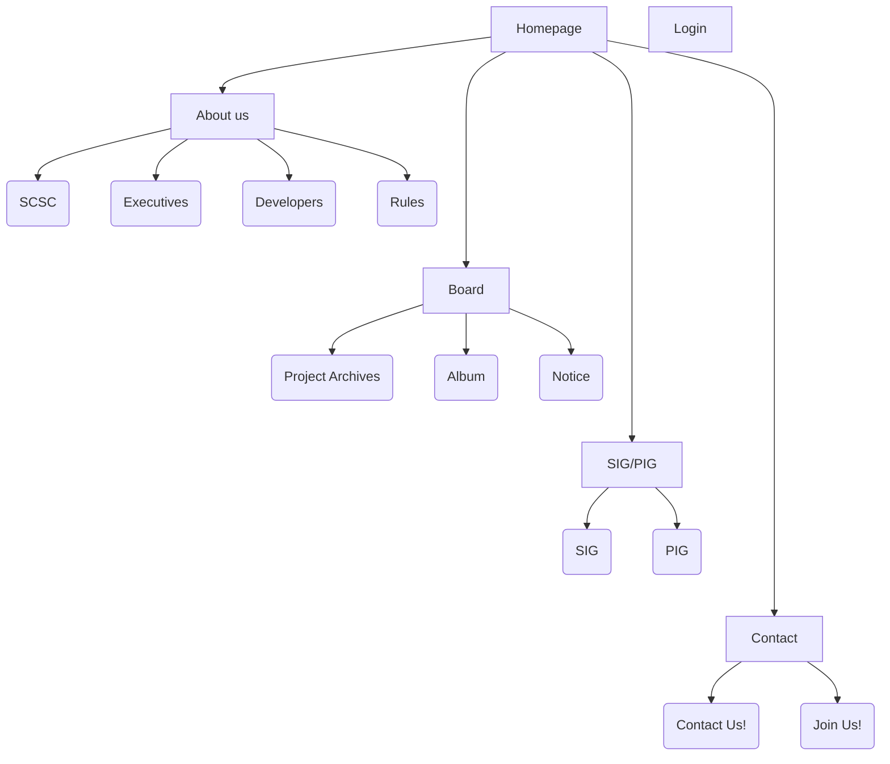

  

<video controls src="temp_1751470917284.1414414502.mp4" title="Title"></video>

---

## Overall

Requests : 배경색에 대한 변경 제안이 있을 시 부탁

---

## Headers & Footers

### Header Composition: 

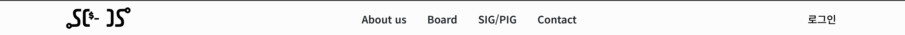

- Logo   
  </img>   
- About us
- Board
- SIG/PIG
- Contact
- 로그인

Functions :  
1. 메뉴 위 마우스 호버 이벤트(특정 오브젝트 위에 마우스를 올려 놓을 시 발생하는 변화): 토글 
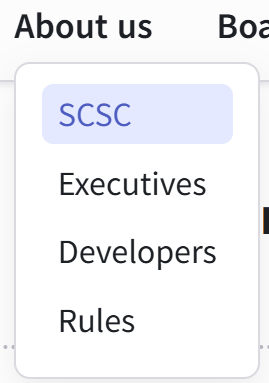
  

Notes : `None`

Requests :  
Header size 및 버튼 배치에 변경  
사진과 같이 세부 사항을 확인할 때 뜨는 창에서 호버 이벤트 속 색  

### Footer Composition: 

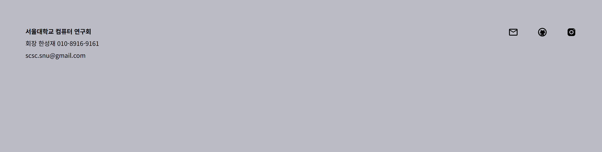

- 대표자(회장) 연락처
- 동아리 공식 계정(EMail, GitHub, Instagram)

Functions : `None`

Notes : `None`

Requests :  

## Homepage
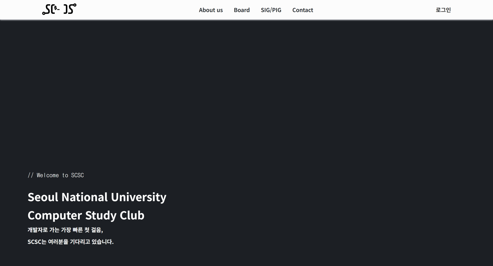

Functions : 
로딩 시 "//Welcome to SCSC" 문구가 입력된 후 커서가 깜빡이는 상태 유지  
<video src="HomepageText.mp4" controls width="600"></video>

Notes :  
Fineart 메인 페이지와 유사하게 배경에   
단일 페이지

References : [Fineart](https://fireart.studio/)

Requests : `None`

## Login

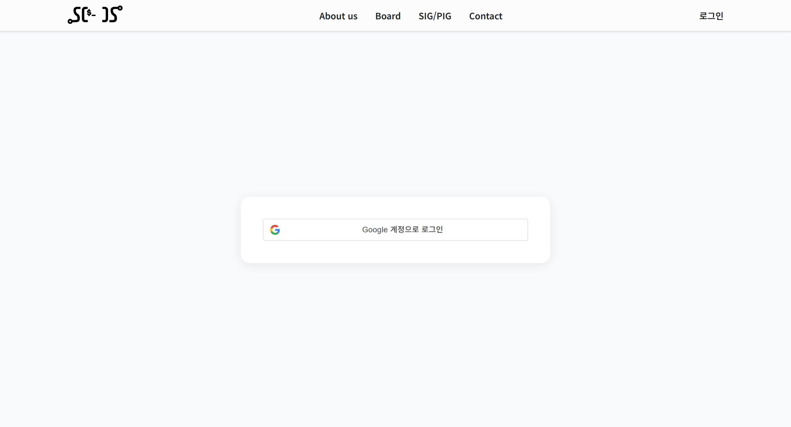

Functions : 현재 구현된 것이 거의 없는 상태

Notes : 현재 Google을 통해 계정을 관리하나, 로그인 페이지에 저 버튼이 하나 뿐인 것이므로 시각적으로 허전

References : [Muzli](https://muz.li/)

Requests :  
SCSC 로고 등의 이미지 및 로그인 버튼 오브젝트를 포함한 로그인 페이지 구성 (위 Reference) 

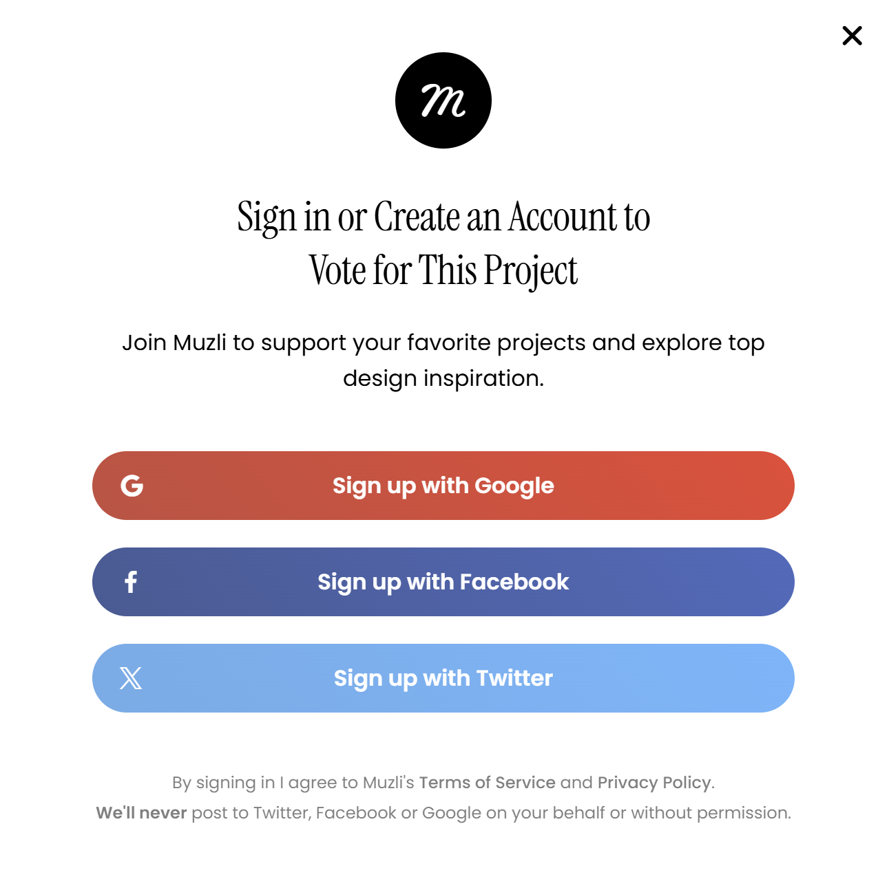
(Muzli의 로그인 창)

위 이미지 참고 요망  
각각의 요소들에 대한 글씨체 설정

## MyPage 

Notes :  
 
포함 요소
- 이메일
- 이름
- 전화번호
- 학번
- 전공
현재는 배치가 되어 있지 않은 상태이며, 추후 다른 인적사항 항목이 추가될 수도 있음.

References : [Examples](https://fireart.studio/blog/how-to-design-best-profile-page-top-15-examples/)

Requests :  
개인인적사항이 작성되어 있는 페이지를 제작

---
## About us

### SCSC

Functions :  
스크롤에 따라 페이드인으로 아래의 요소들이 표시되기 시작함  
'동아리방에는 무엇이 있을까요?'에서 각각의 사진 포함 박스에 마우스 호버 시 미세 이동을 통한 입체적 효과 있음  
'SCSC에 대해 더 알아보고 싶다면?' 아래에 링크들 연결  
FAQ에서 토글 존재

Notes :  
현재는 그저 텍스트 박스들에 의해 정리가 되어 있으며, 일직선으로 모든 오브젝트 배치되어 있는 상태.

References : [Apple](https://www.apple.com/store), [Dropbox](https://www.dropbox.com/dropbox), [Muzli](https://muz.li/)

Requests :  
현재 배치되어 있는 오브젝트들을 청크화한 후 재배치  
글자 스타일 & 사이즈 변경  

### Executives

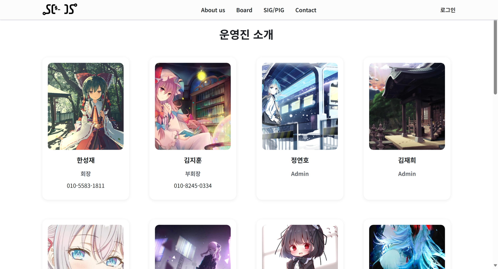

Functions :  
각 박스에 대한 호버 이벤트 (영상 참고)

Notes :  
Developers 페이지와 사실상 동일

References : [Apple](https://www.apple.com/store)

Requests :  
박스 배치 및 페이지 구성에 대한 개선 (예: Apple 페이지의 프로덕트 표시처럼 가로 스크롤로 배치, 박스 형태 변경 등)  
활용되는 글씨체 개선 제안

### Developers

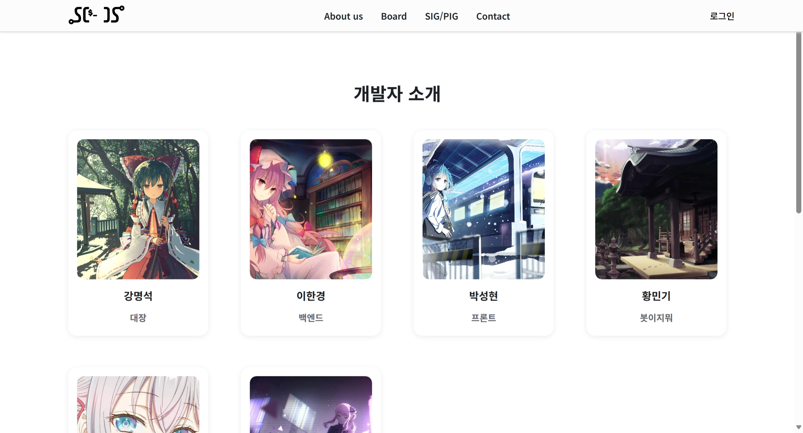

Notes : Executives 페이지와 동일

### Rules

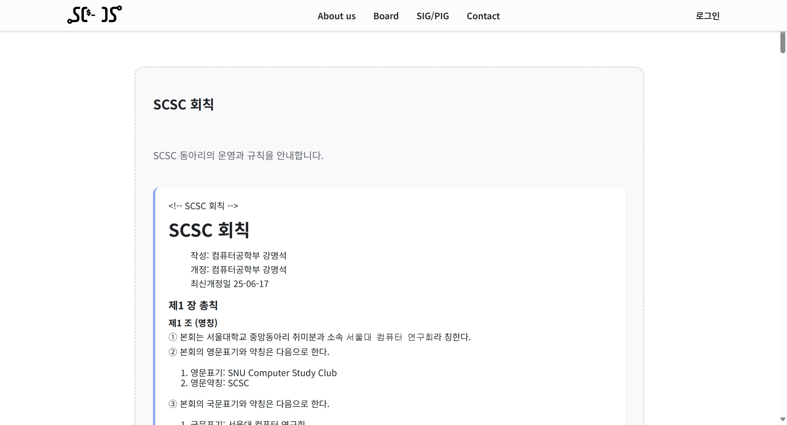

Functions : None

Notes :  
회칙이 그냥 단순 텍스트 박스 안에 포함되어 있으며, 가운데에 오브젝트로 존재. 해당 오브젝트 외의 페이지가 비어 있어 미완성 또는 미흡의 느낌을 줌.

References : [민법](https://law.go.kr/lsSc.do?section=&menuId=1&subMenuId=15&tabMenuId=81&eventGubun=060101&query=%EB%AF%BC%EB%B2%95#AJAX), [Apple Privacy Policy](https://www.apple.com/legal/privacy/en-ww/), [AirBnB 이용약관](https://www.airbnb.co.kr/help/article/2908), [Dropbox Terms of Service](https://www.dropbox.com/en/terms)

Requests :  
민법 

## Board

### Project Archives

### Album

Notes :

Requests : 

### Notice

Notes :

Requests : 

## SIG/PIG

### SIG

Functions :

Notes :

Requests : 

### PIG

Functions :

Notes :

Requests : 

## Contact

### Contact Us!

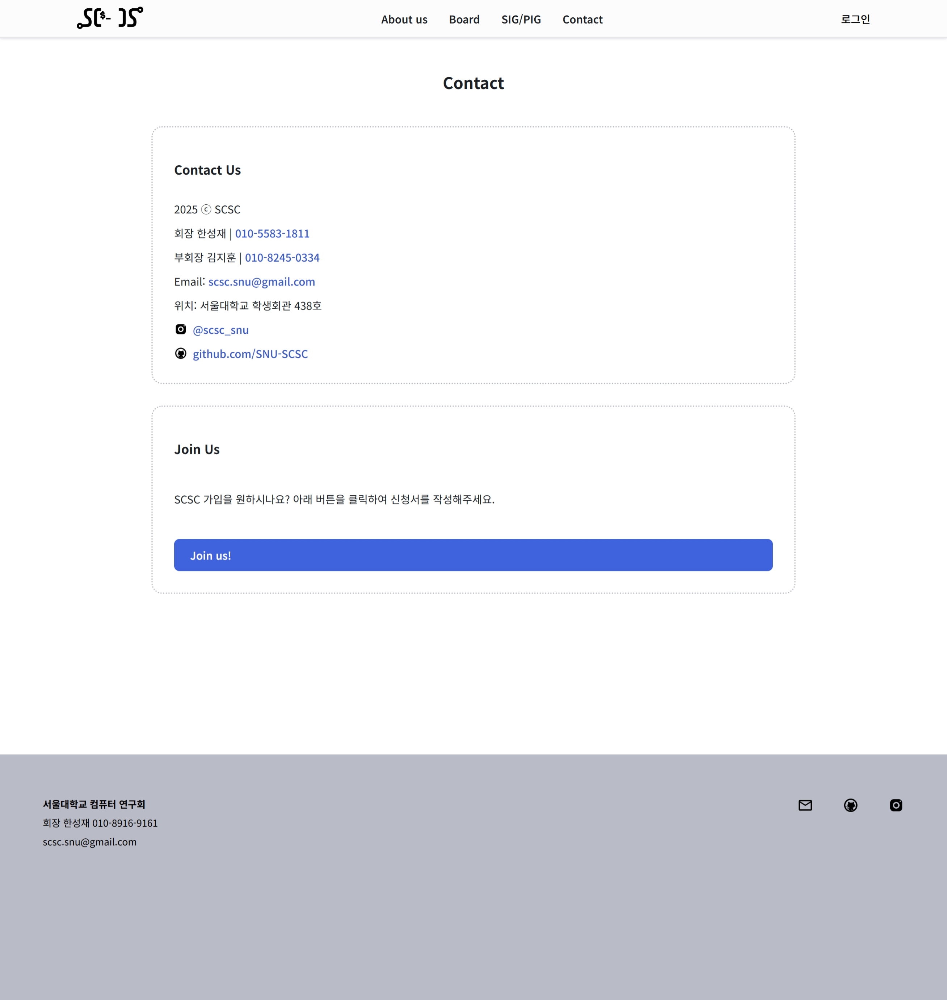

Functions :

Notes :

Requests : 

### Join Us!

Functions : `None`

Notes : Not implemented yet.

Requests : 